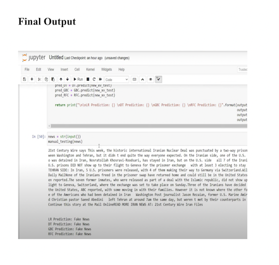

# fake_news
This is my fake news detection repository.

---

## 📌 Project Overview

This repository contains a machine learning project that detects whether a news article is **real** or **fake** using Natural Language Processing and supervised learning models.

It allows users to enter any news content, and it returns whether the article is **REAL** or **FAKE**, based on a pre-trained model. The goal is to help users quickly assess the credibility of news articles in today's information-heavy digital age.

---

## 🔍 Techniques Used

- Data Preprocessing (text cleaning, stopwords, stemming)
- TF-IDF Vectorization
- Machine Learning: Logistic Regression,Decision tree, Random forest, Gradient boosting Classifier
- Model Evaluation: Accuracy, Confusion Matrix
- Manual Testing via custom CSV inputs

---
## 🧪 Try It Yourself
## 🚀 Live Demo (streamlit)

Try it live here 👉 [Fake News Detection App](https://fake-news-detection-xznd3ky8f33ollehewlge3.streamlit.app/#fake-news-detection)

---

## 📊 Example Output on streamlit


---

## 🧪 Try It in Google Colab

You can also run the training and testing notebook using the original datasets on [Google Colab](https://colab.research.google.com/). This allows you to view the full pipeline from data loading to model building and evaluation.

> 🧾 Make sure to upload `Fake.csv` and `True.csv` while running in Colab.

---

## 📊 Example Output on google colab

- Accuracy: ~93% on test data
- Manual prediction on headlines: returns **FAKE** or **REAL**





---

## 🧠 How It Works

- **Dataset**: Combined and labeled fake/real news articles from Kaggle datasets (`Fake.csv` and `True.csv`)
- **Preprocessing**: Text cleaning, stopword removal, TF-IDF vectorization
- **Model**: PassiveAggressiveClassifier (Scikit-learn)
- **Interface**: Built using Streamlit with a simple and clean user input flow

---

## 🛠️ Tech Stack

- Python 3.8
- Pandas, NumPy, Scikit-learn, Joblib
- Streamlit (for UI)
- TF-IDF Vectorizer (for text feature extraction)
- PassiveAggressiveClassifier (for classification)

---

## 📁 Project Structure

```
├── app.py                # Streamlit UI application
├── model.pkl             # Trained classification model
├── vectorizer.pkl        # TF-IDF vectorizer used to transform text
├── requirements.txt      # Required dependencies for deployment
├── Fake_news_detection.ipynb  # Jupyter notebook for training
└── README.md             # Project documentation
```

---

## 🧪 How to Run Locally

1. Clone the repository

```bash
git clone https://github.com/your-username/fake-news-detection.git
cd fake-news-detection
```

2. Install dependencies

```bash
pip install -r requirements.txt
```

3. Launch the app

```bash
streamlit run app.py
```

---

## ⚠️ Dataset Info

The training datasets `Fake.csv` and `True.csv` used for building this model are not included due to GitHub's file size limits.

They were sourced from Kaggle:  
👉 [Fake and Real News Dataset](https://www.kaggle.com/datasets/clmentbisaillon/fake-and-real-news-dataset)

# 📰 Fake News Detection Web App

[](https://fake-news-detection-xznd3ky8f33ollehewlge3.streamlit.app/#fake-news-detection)
[](https://www.python.org/)
[](LICENSE)

---

## ✍️ Author

## 📸 Screenshot


**Sanjana Patnam**  
M.S. in Data Analytics Engineering  
Northeastern University  

🔗 [My Portfolio](https://patnamsanjana15.github.io/sanjana-portfolio/)  
📧 patnam.sa@northeastern.edu

---

## 📜 License

This project is licensed under the [MIT License](LICENSE).
